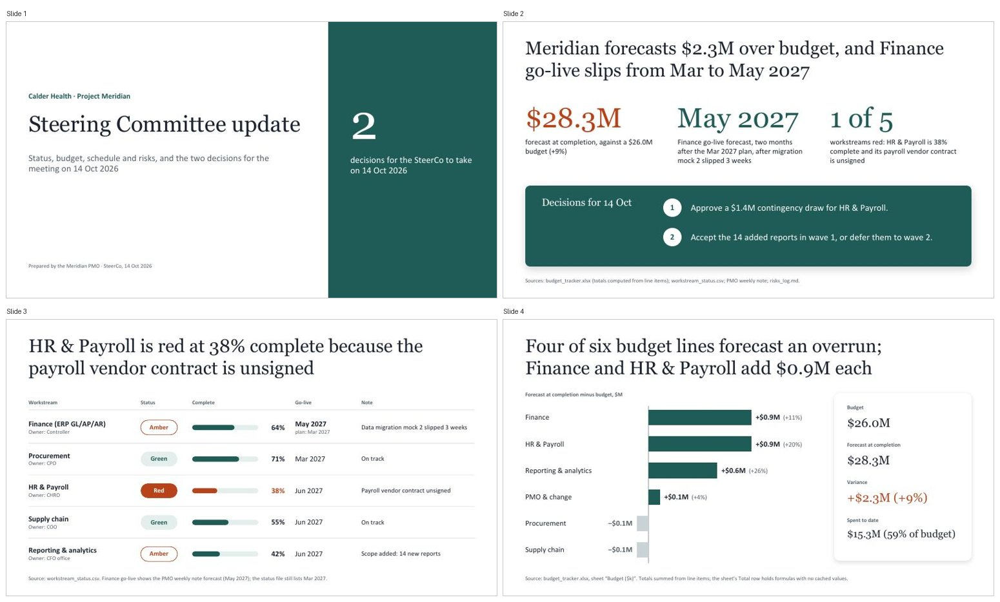
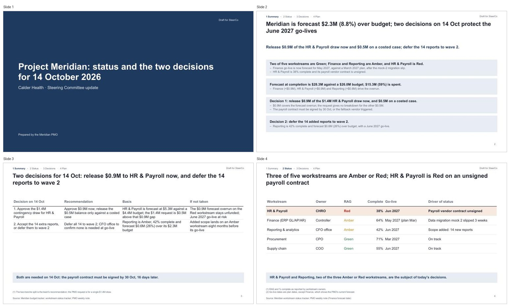
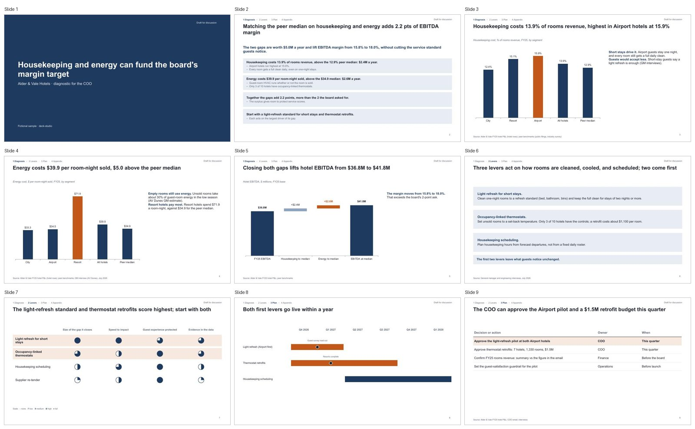
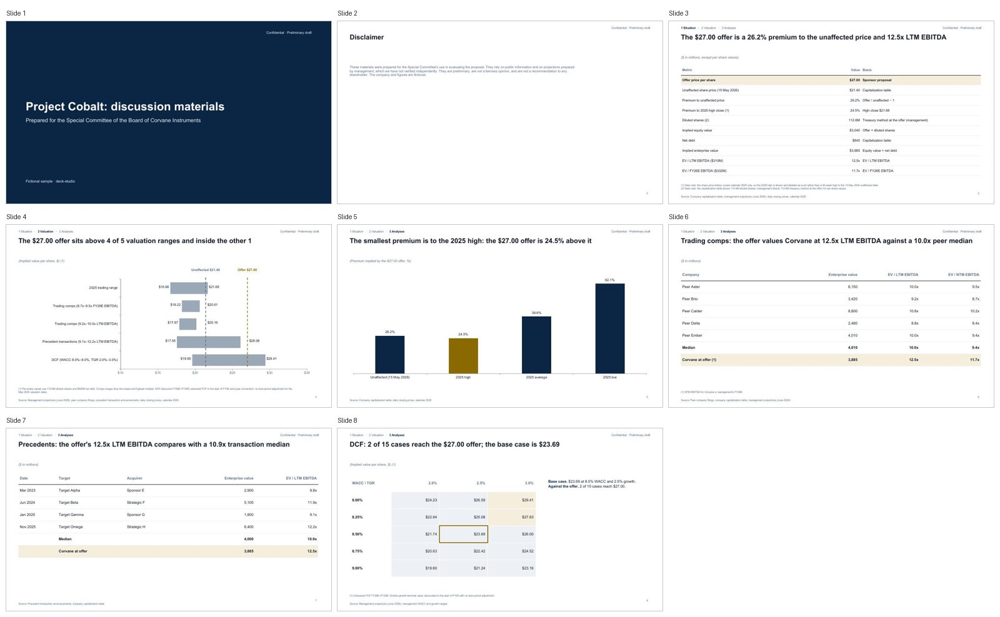

# deck-studio

A Claude Code plugin with one skill, **premium-decks**. Give it a folder of
spreadsheets, PDFs, and notes; it builds a deck that an executive, a partner,
or a banker would send without edits, either as a client-editable `.pptx` or as
a self-contained HTML deck.

- **Three registers.** *Keynote* for talks and all-hands, *consulting* for
  diagnostics and SteerCo updates (answer-first storylines, action titles), and
  *banking* for board books and strategic-alternatives books.
- **Every number traces to a source.** The folder is ingested into a fact
  base; each figure on a slide cites a fact id or a `calc:` line.
- **QA that can fail.** Storyline lint, number tracing, arithmetic integrity
  (waterfalls, totals, one value per metric), layout collisions, copy lint,
  and a render check.

## Install

```bash
claude plugin marketplace add UncleOlu/deck-studio
claude plugin install deck-studio@deck-studio
```

Then check the machine: `python3 skills/premium-decks/scripts/doctor.py` in the
installed plugin prints what is missing and how to fix it. Requirements:
Python ≥ 3.9 (`pip install -r requirements.txt`), Node ≥ 18 (pptxgenjs is
vendored), and for visual QA a renderer (LibreOffice on any OS, or PowerPoint
or Keynote on macOS) plus poppler.

## 60-second demo

```text
> The folder ./q3-review holds our cost data and the peer benchmarks.
  Build the SteerCo deck on the margin gap, with the decisions we need.
```

The skill ingests the folder, flags conflicting values, proposes a storyline
and ghost deck for approval, builds the `.pptx` from its kit, and runs the QA
gate (`scripts/qa-deck.py`). Worked examples, built end to end from fictional
inputs, are in `skills/premium-decks/samples/`:

| Sample | Register | Built from |
|---|---|---|
| `alder-vale-margin-diagnostic` | consulting | `samples/source/alder-vale-hotels/` |
| `corvane-special-committee-book` | banking (board book) | `samples/source/corvane-instruments/` |
| `halden-strategic-alternatives` | banking (strategic alternatives) | `samples/source/halden-freight/` |
| `northlane-pitch`, `ridgeline-card-cost.html` | keynote | hand-written briefs |

## Before and after

The same fictional SteerCo brief, built by v1.3.3 (left) and v1.4 (right).
v1.4 adds the consulting register: action titles, a tracker, sources named as
business documents rather than files, and a decisions page by slide 3. Blind
judges preferred v1.4 on this case, but across all seven eval cases they were
split (overall mean 4.02 for both), and they could still tell every generated
slide from a real one; see `evals/reports/`.

| v1.3.3 | v1.4 |
|---|---|
|  |  |

| Consulting sample | Board-book sample |
|---|---|
|  |  |

## Methodology

The consulting and banking rules come from a coded study of public decks:
131 consulting and banking decks (95 coded, 28 held out for a blind
discrimination test), plus 8 banker discussion books from SEC filings for the
strategic-alternatives recipe. Every rule records its support and what was
rejected. See `research/corpus-findings.md`, `research/pitchbook-findings.md`,
and `research/corpus-sources.md` (source URLs only; the decks themselves are
never redistributed). Evals live in `evals/`: seven deck-building cases, six
trigger cases, an objective scorer, and a blind judge.

## Layout

```
skills/premium-decks/
  SKILL.md       routing (mode × register), workflow, QA order
  references/    storyline, frameworks, consulting and banking grammar, finance charts,
                 quality floor, design DNA, PPTX and HTML mode, HTML components and finance
  scripts/       ingest, qa-deck (runs every check), storyline-lint, trace-check,
                 integrity-check, layout-check, validate_pptx, deck_edit, doctor, …
  templates/     the deck kit (pptxgenjs, vendored) and the register builders
  samples/       worked examples; build_samples.py rebuilds the ingest-path samples
research/        the corpus study behind the registers
evals/           eval cases, harvest, objective scorer, blind judge
tests/           pytest suite for the scripts
docs/history/    plans and audits from earlier releases
```

## Development

```bash
python3 -m venv .venv && .venv/bin/pip install -r requirements.txt pytest ruff jsonschema
.venv/bin/python -m pytest -q
.venv/bin/ruff check .
```

`CONTRIBUTING.md` covers versioning, the changelog rules, and how to run the
evals. Report security issues as described in `SECURITY.md`.

## Licence

MIT (`LICENSE`), by Olu. Third-party material and its licences are listed in
`NOTICE` and `PROVENANCE.md`.
